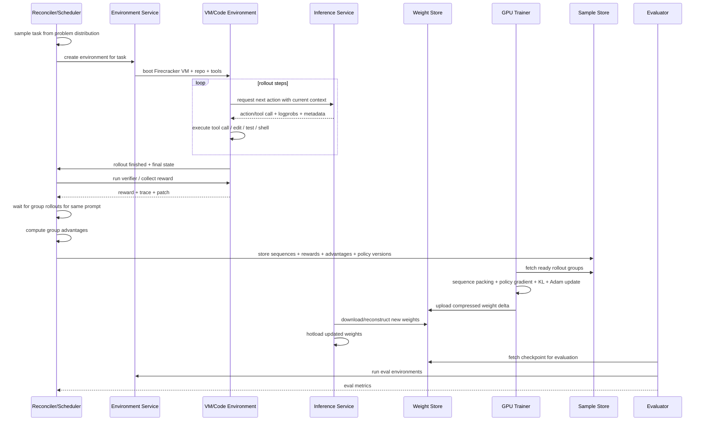

```mermaid
sequenceDiagram
    participant R as Reconciler/Scheduler
    participant E as Environment Service
    participant V as VM/Code Environment
    participant I as Inference Service
    participant W as Weight Store
    participant T as GPU Trainer
    participant S as Sample Store
    participant Q as Evaluator

    R->>R: sample task from problem distribution
    R->>E: create environment for task
    E->>V: boot Firecracker VM + repo + tools

    loop rollout steps
        V->>I: request next action with current context
        I-->>V: action/tool call + logprobs + metadata
        V->>V: execute tool call / edit / test / shell
    end

    V->>R: rollout finished + final state
    R->>V: run verifier / collect reward
    V-->>R: reward + trace + patch

    R->>R: wait for group rollouts for same prompt
    R->>R: compute group advantages
    R->>S: store sequences + rewards + advantages + policy versions

    T->>S: fetch ready rollout groups
    T->>T: sequence packing + policy gradient + KL + Adam update
    T->>W: upload compressed weight delta

    I->>W: download/reconstruct new weights
    I->>I: hotload updated weights

    Q->>W: fetch checkpoint for evaluation
    Q->>E: run eval environments
    Q-->>R: eval metrics

```