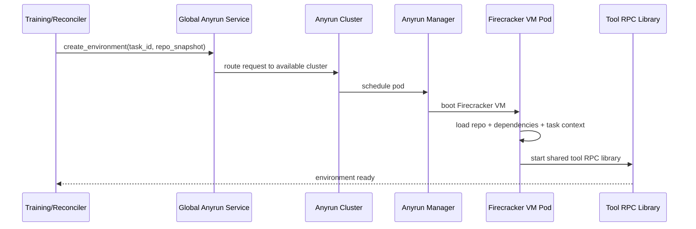

```mermaid
sequenceDiagram
    participant Trainer as Training/Reconciler
    participant Global as Global Anyrun Service
    participant Cluster as Anyrun Cluster
    participant Manager as Anyrun Manager
    participant VM as Firecracker VM Pod
    participant Tools as Tool RPC Library

    Trainer->>Global: create_environment(task_id, repo_snapshot)
    Global->>Cluster: route request to available cluster
    Cluster->>Manager: schedule pod
    Manager->>VM: boot Firecracker VM
    VM->>VM: load repo + dependencies + task context
    VM->>Tools: start shared tool RPC library
    Tools-->>Trainer: environment ready
```