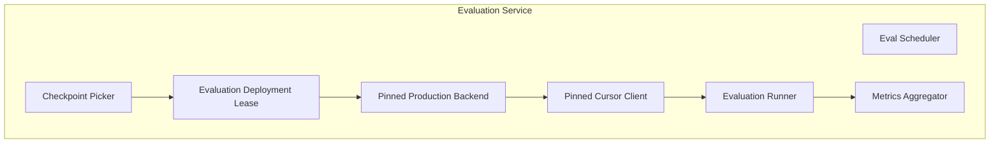

```mermaid


flowchart TB
    subgraph EVAL_SERVICE["Evaluation Service"]
        EVAL_SCHED["Eval Scheduler"]
        CKPT_PICKER["Checkpoint Picker"]
        LEASE["Evaluation Deployment Lease"]
        PROD_BACKEND["Pinned Production Backend"]
        CURSOR_CLIENT["Pinned Cursor Client"]
        EVAL_RUNNER["Evaluation Runner"]
        METRICS["Metrics Aggregator"]
    end

    CKPT_PICKER --> LEASE
    LEASE --> PROD_BACKEND
    PROD_BACKEND --> CURSOR_CLIENT
    CURSOR_CLIENT --> EVAL_RUNNER
    EVAL_RUNNER --> METRICS


```