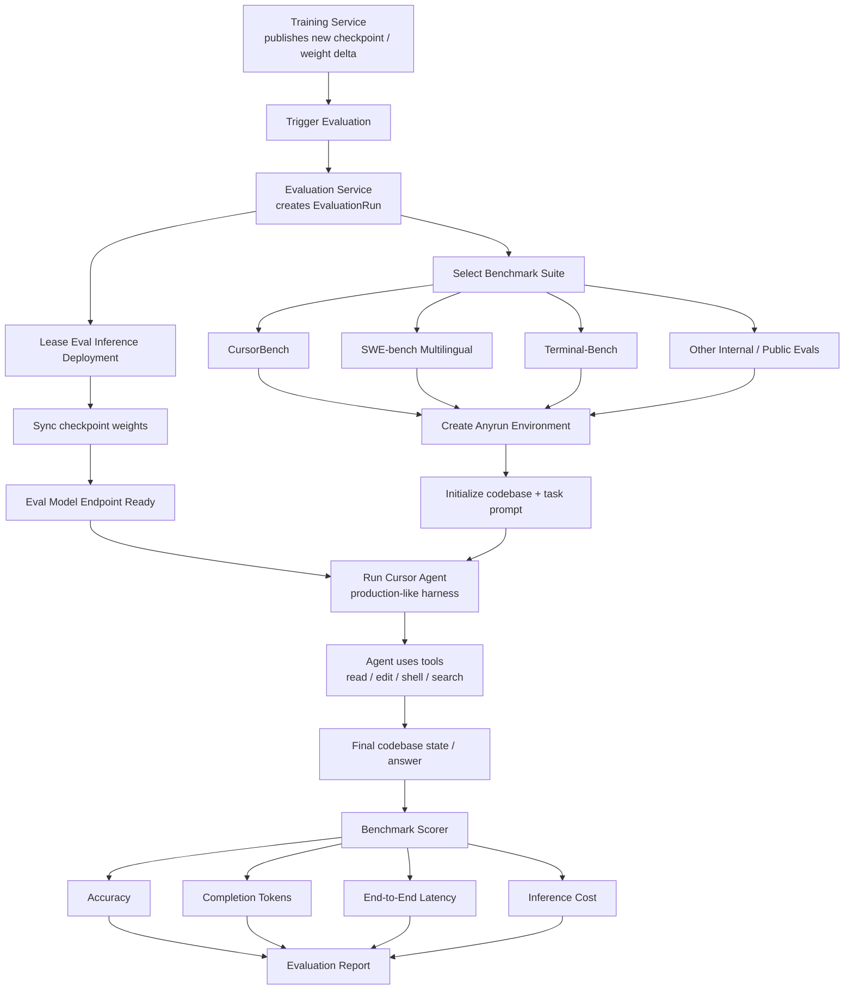

```mermaid


flowchart TD
    A[Training Service<br/>publishes new checkpoint / weight delta] --> B[Trigger Evaluation]

    B --> C[Evaluation Service<br/>creates EvaluationRun]

    C --> D[Lease Eval Inference Deployment]
    D --> E[Sync checkpoint weights]
    E --> F[Eval Model Endpoint Ready]

    C --> G[Select Benchmark Suite]

    G --> H[CursorBench]
    G --> I[SWE-bench Multilingual]
    G --> J[Terminal-Bench]
    G --> K[Other Internal / Public Evals]

    H --> L[Create Anyrun Environment]
    I --> L
    J --> L
    K --> L

    L --> M[Initialize codebase + task prompt]

    F --> N[Run Cursor Agent<br/>production-like harness]
    M --> N

    N --> O[Agent uses tools<br/>read / edit / shell / search]
    O --> P[Final codebase state / answer]

    P --> Q[Benchmark Scorer]

    Q --> R[Accuracy]
    Q --> S[Completion Tokens]
    Q --> T[End-to-End Latency]
    Q --> U[Inference Cost]

    R --> V[Evaluation Report]
    S --> V
    T --> V
    U --> V
 
```