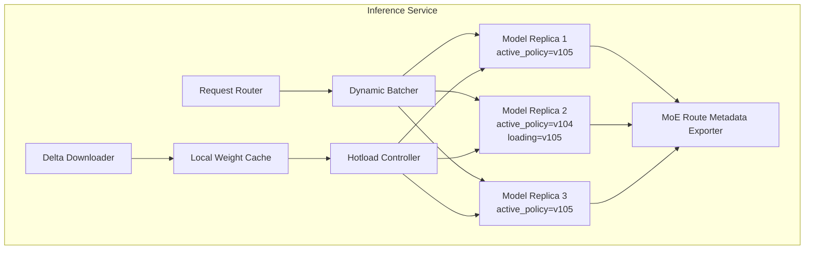
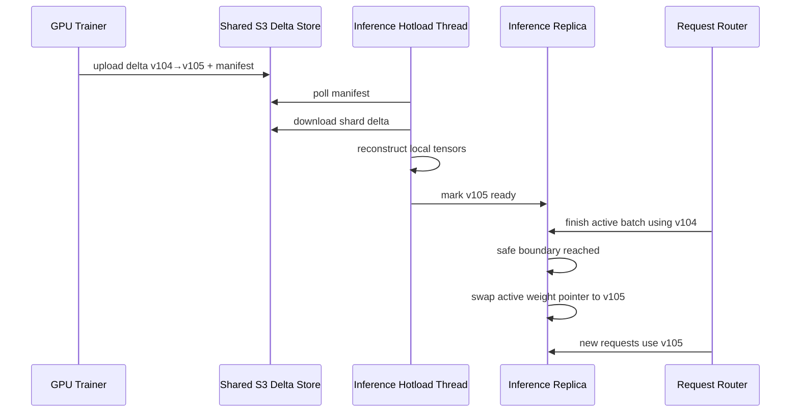
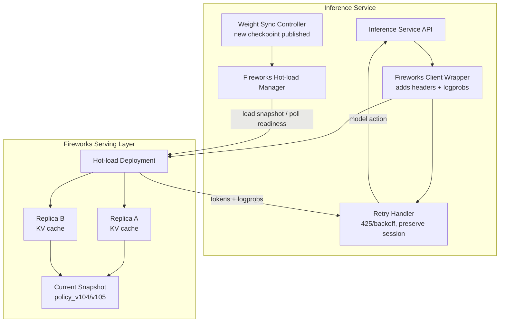

```mermaid

flowchart TB
    subgraph INFERENCE_SERVICE["Inference Service"]
        ROUTER["Request Router"]
        BATCHER["Dynamic Batcher"]
        REPLICA1["Model Replica 1<br/>active_policy=v105"]
        REPLICA2["Model Replica 2<br/>active_policy=v104<br/>loading=v105"]
        REPLICA3["Model Replica 3<br/>active_policy=v105"]
        HOTLOAD["Hotload Controller"]
        DELTA_DL["Delta Downloader"]
        WEIGHT_CACHE["Local Weight Cache"]
        ROUTE_REPLAY["MoE Route Metadata Exporter"]
    end

    ROUTER --> BATCHER
    BATCHER --> REPLICA1
    BATCHER --> REPLICA2
    BATCHER --> REPLICA3

    DELTA_DL --> WEIGHT_CACHE
    WEIGHT_CACHE --> HOTLOAD
    HOTLOAD --> REPLICA1
    HOTLOAD --> REPLICA2
    HOTLOAD --> REPLICA3

    REPLICA1 --> ROUTE_REPLAY
    REPLICA2 --> ROUTE_REPLAY
    REPLICA3 --> ROUTE_REPLAY

```

## Hotload workflow

```mermaid

sequenceDiagram
    participant Trainer as GPU Trainer
    participant S3 as Shared S3 Delta Store
    participant Loader as Inference Hotload Thread
    participant Replica as Inference Replica
    participant Router as Request Router

    Trainer->>S3: upload delta v104→v105 + manifest
    Loader->>S3: poll manifest
    Loader->>S3: download shard delta
    Loader->>Loader: reconstruct local tensors
    Loader->>Replica: mark v105 ready
    Router->>Replica: finish active batch using v104
    Replica->>Replica: safe boundary reached
    Replica->>Replica: swap active weight pointer to v105
    Router->>Replica: new requests use v105

```

```mermaid
flowchart TD
    B[Inference Service API]

    subgraph INF[Inference Service]
        B --> E[Fireworks Client Wrapper<br/>adds headers + logprobs]
        E --> F[Retry Handler<br/>425/backoff, preserve session]
        H[Weight Sync Controller<br/>new checkpoint published] --> I[Fireworks Hot-load Manager]
    end

    subgraph FW[Fireworks Serving Layer]
        J[Hot-load Deployment]
        K[Replica A<br/>KV cache]
        L[Replica B<br/>KV cache]
        M[Current Snapshot<br/>policy_v104/v105]
    end

    E --> J
    J --> K
    J --> L
    K --> M
    L --> M

    J -->|tokens + logprobs| F
    F -->|model action| B

    I -->|load snapshot / poll readiness| J

```