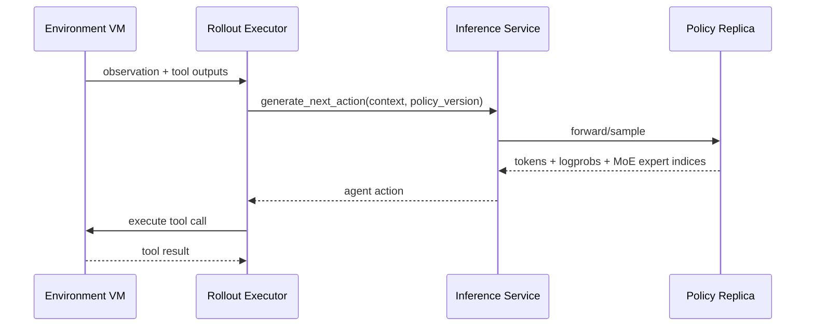

```mermaid

sequenceDiagram
    participant Env as Environment VM
    participant Agent as Rollout Executor
    participant Inf as Inference Service
    participant Model as Policy Replica

    Env->>Agent: observation + tool outputs
    Agent->>Inf: generate_next_action(context, policy_version)
    Inf->>Model: forward/sample
    Model-->>Inf: tokens + logprobs + MoE expert indices
    Inf-->>Agent: agent action
    Agent->>Env: execute tool call
    Env-->>Agent: tool result
```