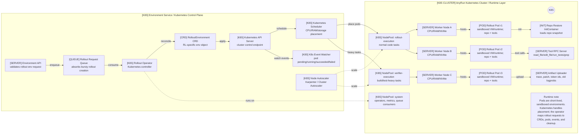

```mermaid
flowchart LR
  subgraph env["[K8S] Environment Service / Kubernetes Control Plane"]
    env_api["[SERVER] Environment API<br/>validates rollout env request"]
    queue["[QUEUE] Rollout Request Queue<br/>absorbs bursty rollout creation"]
    operator["[K8S] Rollout Operator<br/>Kubernetes controller"]
    watcher["[K8S] K8s Event Watcher<br/>pod pending/running/succeeded/failed"]
    k8s_api["[K8S] Kubernetes API Server<br/>cluster control endpoint"]
    crd["[CRD] RolloutEnvironment CRD<br/>RL-specific env object"]
    scheduler["[K8S] Kubernetes Scheduler<br/>CPU/RAM/storage placement"]
    autoscaler["[K8S] Node Autoscaler<br/>Karpenter / Cluster Autoscaler"]
  end

  subgraph cluster["[K8S CLUSTER] AnyRun Kubernetes Cluster / Runtime Layer"]
    k8s((K8S))
    np_system["[K8S] NodePool: system<br/>operators, metrics, queue consumers"]
    np_general["[K8S] NodePool: rollout-execution <br/>normal code tasks"]
    np_heavy["[K8S] NodePool: verifier-execution <br/>build/test-heavy tasks"]
    worker_a["[SERVER] Worker Node A<br/>CPU/RAM/NVMe"]
    worker_b["[SERVER] Worker Node B<br/>CPU/RAM/NVMe"]
    worker_c["[SERVER] Worker Node C<br/>CPU/RAM/NVMe"]
    pod_r1["[POD] Rollout Pod r1<br/>sandboxed VM/runtime; repo + tools"]
    pod_r2["[POD] Rollout Pod r2<br/>sandboxed VM/runtime; repo + tools"]
    pod_r3["[POD] Rollout Pod r3<br/>sandboxed VM/runtime; repo + tools"]
    init_repo["[INIT] Repo Restore InitContainer<br/>loads repo snapshot"]
    tool_rpc["[SERVER] Tool RPC Server<br/>read_file/edit_file/run_tests/grep"]
    artifact["[SERVER] Artifact Uploader<br/>trace, patch, token ids, old logprobs"]
    runtime_note["Runtime note<br/>Pods are short-lived, sandboxed environments. Kubernetes handles placement; the operator maps rollout requests to CRDs, pods, events, and cleanup."]
  end

  env_api -->|enqueue| queue
  queue -->|consume| operator
  operator -->|reconcile| crd
  crd -->|apply| k8s_api
  k8s_api -->|schedule| scheduler
  k8s_api -->|watch events| watcher

  scheduler -->|place pods| np_general
  scheduler -->|heavy tasks| np_heavy

  autoscaler -.->|scale| np_general
  autoscaler -.->|scale| np_heavy

  operator -.->|runs on| np_system

  np_general --> worker_a
  np_general --> worker_b
  np_heavy --> worker_c

  worker_a -->|hosts| pod_r1
  worker_b -->|hosts| pod_r2
  worker_c -->|hosts| pod_r3

  pod_r1 -->|init| init_repo
  pod_r2 -->|tool calls| tool_rpc
  pod_r3 -->|upload| artifact
```
