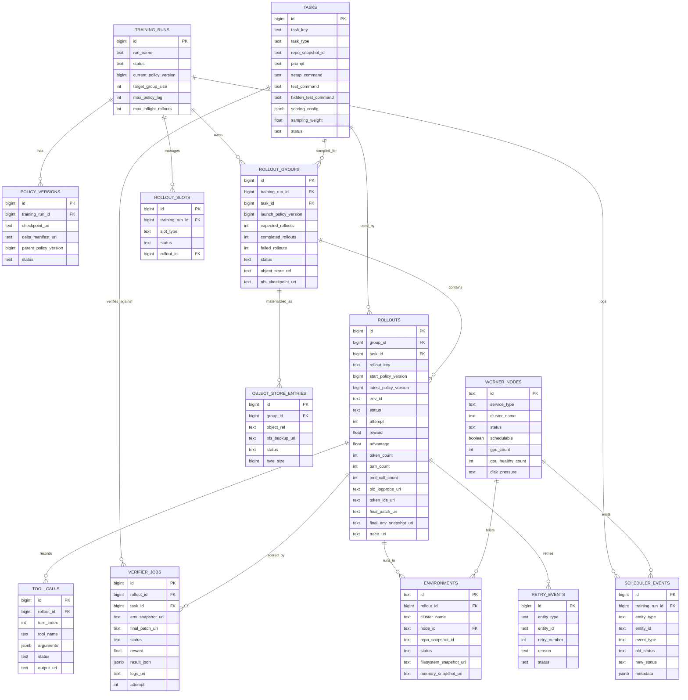

```mermaid

erDiagram
    TRAINING_RUNS ||--o{ POLICY_VERSIONS : has
    TRAINING_RUNS ||--o{ ROLLOUT_GROUPS : owns
    TRAINING_RUNS ||--o{ ROLLOUT_SLOTS : manages
    TRAINING_RUNS ||--o{ SCHEDULER_EVENTS : logs

    TASKS ||--o{ ROLLOUT_GROUPS : sampled_for
    TASKS ||--o{ ROLLOUTS : used_by
    TASKS ||--o{ VERIFIER_JOBS : verifies_against

    ROLLOUT_GROUPS ||--o{ ROLLOUTS : contains
    ROLLOUT_GROUPS ||--o{ OBJECT_STORE_ENTRIES : materialized_as

    ROLLOUTS ||--o{ TOOL_CALLS : records
    ROLLOUTS ||--o{ VERIFIER_JOBS : scored_by
    ROLLOUTS ||--o{ ENVIRONMENTS : runs_in
    ROLLOUTS ||--o{ RETRY_EVENTS : retries

    WORKER_NODES ||--o{ ENVIRONMENTS : hosts
    WORKER_NODES ||--o{ SCHEDULER_EVENTS : emits

    TRAINING_RUNS {
        bigint id PK
        text run_name
        text status
        bigint current_policy_version
        int target_group_size
        int max_policy_lag
        int max_inflight_rollouts
    }

    POLICY_VERSIONS {
        bigint id PK
        bigint training_run_id FK
        text checkpoint_uri
        text delta_manifest_uri
        bigint parent_policy_version
        text status
    }

    TASKS {
        bigint id PK
        text task_key
        text task_type
        text repo_snapshot_id
        text prompt
        text setup_command
        text test_command
        text hidden_test_command
        jsonb scoring_config
        float sampling_weight
        text status
    }

    ROLLOUT_GROUPS {
        bigint id PK
        bigint training_run_id FK
        bigint task_id FK
        bigint launch_policy_version
        int expected_rollouts
        int completed_rollouts
        int failed_rollouts
        text status
        text object_store_ref
        text nfs_checkpoint_uri
    }

    ROLLOUTS {
        bigint id PK
        bigint group_id FK
        bigint task_id FK
        text rollout_key
        bigint start_policy_version
        bigint latest_policy_version
        text env_id
        text status
        int attempt
        float reward
        float advantage
        int token_count
        int turn_count
        int tool_call_count
        text old_logprobs_uri
        text token_ids_uri
        text final_patch_uri
        text final_env_snapshot_uri
        text trace_uri
    }

    ENVIRONMENTS {
        text id PK
        bigint rollout_id FK
        text cluster_name
        text node_id FK
        text repo_snapshot_id
        text status
        text filesystem_snapshot_uri
        text memory_snapshot_uri
    }

    TOOL_CALLS {
        bigint id PK
        bigint rollout_id FK
        int turn_index
        text tool_name
        jsonb arguments
        text status
        text output_uri
    }

    VERIFIER_JOBS {
        bigint id PK
        bigint rollout_id FK
        bigint task_id FK
        text env_snapshot_uri
        text final_patch_uri
        text status
        float reward
        jsonb result_json
        text logs_uri
        int attempt
    }

    RETRY_EVENTS {
        bigint id PK
        text entity_type
        text entity_id
        int retry_number
        text reason
        text status
    }

    WORKER_NODES {
        text id PK
        text service_type
        text cluster_name
        text status
        boolean schedulable
        int gpu_count
        int gpu_healthy_count
        text disk_pressure
    }

    ROLLOUT_SLOTS {
        bigint id PK
        bigint training_run_id FK
        text slot_type
        text status
        bigint rollout_id FK
    }

    OBJECT_STORE_ENTRIES {
        bigint id PK
        bigint group_id FK
        text object_ref
        text nfs_backup_uri
        text status
        bigint byte_size
    }

    SCHEDULER_EVENTS {
        bigint id PK
        bigint training_run_id FK
        text entity_type
        text entity_id
        text event_type
        text old_status
        text new_status
        jsonb metadata
    }

```