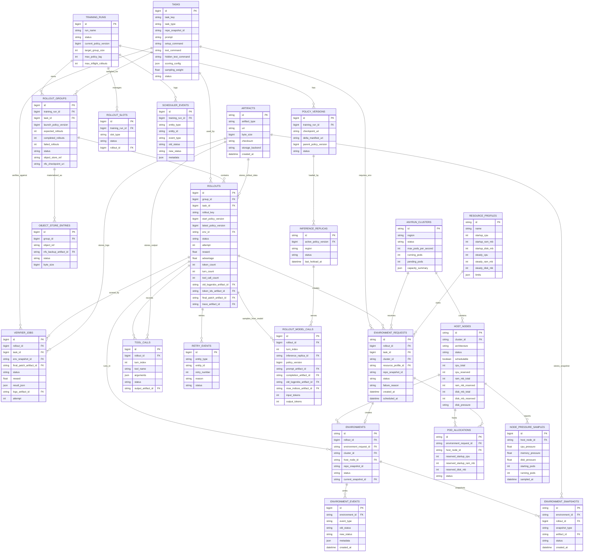

```mermaid

erDiagram
    TRAINING_RUNS ||--o{ POLICY_VERSIONS : has
    TRAINING_RUNS ||--o{ ROLLOUT_GROUPS : owns
    TRAINING_RUNS ||--o{ ROLLOUT_SLOTS : manages
    TRAINING_RUNS ||--o{ SCHEDULER_EVENTS : logs

    TASKS ||--o{ ROLLOUT_GROUPS : sampled_for
    TASKS ||--o{ ROLLOUTS : used_by
    TASKS ||--o{ VERIFIER_JOBS : verifies_against
    TASKS ||--o{ ENVIRONMENT_REQUESTS : requires_env

    ROLLOUT_GROUPS ||--o{ ROLLOUTS : contains
    ROLLOUT_GROUPS ||--o{ OBJECT_STORE_ENTRIES : materialized_as

    ROLLOUTS ||--o{ TOOL_CALLS : records
    ROLLOUTS ||--o{ VERIFIER_JOBS : scored_by
    ROLLOUTS ||--o{ ENVIRONMENTS : runs_in
    ROLLOUTS ||--o{ RETRY_EVENTS : retries
    ROLLOUTS ||--o{ ROLLOUT_MODEL_CALLS : samples_from_model
    ROLLOUTS ||--o{ ENVIRONMENT_REQUESTS : creates

    ANYRUN_CLUSTERS ||--o{ HOST_NODES : contains
    ANYRUN_CLUSTERS ||--o{ ENVIRONMENT_REQUESTS : receives
    HOST_NODES ||--o{ POD_ALLOCATIONS : hosts
    HOST_NODES ||--o{ NODE_PRESSURE_SAMPLES : reports
    HOST_NODES ||--o{ ENVIRONMENTS : hosts

    RESOURCE_PROFILES ||--o{ ENVIRONMENT_REQUESTS : sizes
    ENVIRONMENT_REQUESTS ||--o| ENVIRONMENTS : creates
    ENVIRONMENT_REQUESTS ||--o{ POD_ALLOCATIONS : reserves
    ENVIRONMENTS ||--o{ ENVIRONMENT_EVENTS : emits
    ENVIRONMENTS ||--o{ ENVIRONMENT_SNAPSHOTS : snapshots

    POLICY_VERSIONS ||--o{ INFERENCE_REPLICAS : loaded_by
    INFERENCE_REPLICAS ||--o{ ROLLOUT_MODEL_CALLS : serves

    ARTIFACTS ||--o{ TOOL_CALLS : stores_output
    ARTIFACTS ||--o{ VERIFIER_JOBS : stores_logs
    ARTIFACTS ||--o{ ENVIRONMENT_SNAPSHOTS : stores_snapshot
    ARTIFACTS ||--o{ ROLLOUTS : stores_rollout_data

    TRAINING_RUNS {
        bigint id PK
        string run_name
        string status
        bigint current_policy_version
        int target_group_size
        int max_policy_lag
        int max_inflight_rollouts
    }

    POLICY_VERSIONS {
        bigint id PK
        bigint training_run_id FK
        string checkpoint_uri
        string delta_manifest_uri
        bigint parent_policy_version
        string status
    }

    TASKS {
        bigint id PK
        string task_key
        string task_type
        string repo_snapshot_id
        string prompt
        string setup_command
        string test_command
        string hidden_test_command
        json scoring_config
        float sampling_weight
        string status
    }

    ROLLOUT_GROUPS {
        bigint id PK
        bigint training_run_id FK
        bigint task_id FK
        bigint launch_policy_version
        int expected_rollouts
        int completed_rollouts
        int failed_rollouts
        string status
        string object_store_ref
        string nfs_checkpoint_uri
    }

    ROLLOUTS {
        bigint id PK
        bigint group_id FK
        bigint task_id FK
        string rollout_key
        bigint start_policy_version
        bigint latest_policy_version
        string env_id FK
        string status
        int attempt
        float reward
        float advantage
        int token_count
        int turn_count
        int tool_call_count
        string old_logprobs_artifact_id FK
        string token_ids_artifact_id FK
        string final_patch_artifact_id FK
        string trace_artifact_id FK
    }

    ANYRUN_CLUSTERS {
        string id PK
        string region
        string status
        int max_pods_per_second
        int running_pods
        int pending_pods
        json capacity_summary
    }

    HOST_NODES {
        string id PK
        string cluster_id FK
        string architecture
        string status
        boolean schedulable
        int cpu_total
        int cpu_reserved
        int ram_mb_total
        int ram_mb_reserved
        int disk_mb_total
        int disk_mb_reserved
        string disk_pressure
    }

    NODE_PRESSURE_SAMPLES {
        bigint id PK
        string host_node_id FK
        float cpu_pressure
        float memory_pressure
        float disk_pressure
        int starting_pods
        int running_pods
        datetime sampled_at
    }

    RESOURCE_PROFILES {
        string id PK
        string name
        int startup_cpu
        int startup_ram_mb
        int startup_disk_mb
        int steady_cpu
        int steady_ram_mb
        int steady_disk_mb
        json limits
    }

    ENVIRONMENT_REQUESTS {
        string id PK
        bigint rollout_id FK
        bigint task_id FK
        string cluster_id FK
        string resource_profile_id FK
        string repo_snapshot_id
        string status
        string failure_reason
        datetime created_at
        datetime scheduled_at
    }

    POD_ALLOCATIONS {
        string id PK
        string environment_request_id FK
        string host_node_id FK
        int reserved_startup_cpu
        int reserved_startup_ram_mb
        int reserved_disk_mb
        string status
    }

    ENVIRONMENTS {
        string id PK
        bigint rollout_id FK
        string environment_request_id FK
        string cluster_id FK
        string host_node_id FK
        string repo_snapshot_id
        string status
        string current_snapshot_id FK
    }

    ENVIRONMENT_EVENTS {
        bigint id PK
        string environment_id FK
        string event_type
        string old_status
        string new_status
        json metadata
        datetime created_at
    }

    ENVIRONMENT_SNAPSHOTS {
        string id PK
        string environment_id FK
        bigint rollout_id FK
        string snapshot_type
        string artifact_id FK
        string status
        datetime created_at
    }

    TOOL_CALLS {
        bigint id PK
        bigint rollout_id FK
        int turn_index
        string tool_name
        json arguments
        string status
        string output_artifact_id FK
    }

    ROLLOUT_MODEL_CALLS {
        bigint id PK
        bigint rollout_id FK
        int turn_index
        string inference_replica_id FK
        bigint policy_version
        string prompt_artifact_id FK
        string completion_artifact_id FK
        string old_logprobs_artifact_id FK
        string moe_indices_artifact_id FK
        int input_tokens
        int output_tokens
    }

    INFERENCE_REPLICAS {
        string id PK
        bigint active_policy_version FK
        string region
        string status
        datetime last_hotload_at
    }

    VERIFIER_JOBS {
        bigint id PK
        bigint rollout_id FK
        bigint task_id FK
        string env_snapshot_id FK
        string final_patch_artifact_id FK
        string status
        float reward
        json result_json
        string logs_artifact_id FK
        int attempt
    }

    RETRY_EVENTS {
        bigint id PK
        string entity_type
        string entity_id
        int retry_number
        string reason
        string status
    }

    ROLLOUT_SLOTS {
        bigint id PK
        bigint training_run_id FK
        string slot_type
        string status
        bigint rollout_id FK
    }

    OBJECT_STORE_ENTRIES {
        bigint id PK
        bigint group_id FK
        string object_ref
        string nfs_backup_artifact_id FK
        string status
        bigint byte_size
    }

    ARTIFACTS {
        string id PK
        string artifact_type
        string uri
        bigint byte_size
        string checksum
        string storage_backend
        datetime created_at
    }

    SCHEDULER_EVENTS {
        bigint id PK
        bigint training_run_id FK
        string entity_type
        string entity_id
        string event_type
        string old_status
        string new_status
        json metadata
    }
 
```