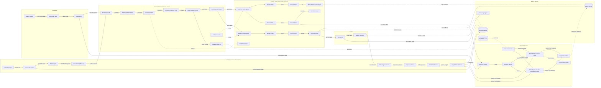

# System Design (Mermaid)

```mermaid
flowchart LR
    subgraph TRAIN[Training Service / RL Control]
        train_service[Training Service]
        reconciler[Central Reconciler]
        task_sampler[Task Sampler]
        group_mgr[Rollout Group Manager]
        adv_comp[Advantage Computer]
        seq_packer[Sequence Packer]
        gpu_trainer[Distributed Trainer]
        weight_pub[Weight Delta Publisher]
    end

    subgraph ENV[Environment Service / K8s Control]
        env_api[Environment API]
        request_queue[Rollout Request Queue]
        operator[Rollout Operator]
        crd[RolloutEnvironment CRD]
        k8s_api[Kubernetes API Server]
        scheduler[Kubernetes Scheduler]
        autoscaler[Node Autoscaler]
        event_watcher[K8s Event Watcher]
    end

    subgraph ANYRUN[AnyRun Kubernetes Cluster Runtime]
        nodepool_system[NodePool system]
        nodepool_general[NodePool rollout-general]
        nodepool_heavy[NodePool rollout-heavy]

        worker_a[Worker Node A]
        worker_b[Worker Node B]
        worker_c[Worker Node C]

        pod_r1[Rollout Pod r1]
        pod_r2[Rollout Pod r2]
        pod_r3[Rollout Pod r3]

        repo_restore[Repo Restore InitContainer]
        tool_rpc[Tool RPC Server]
        artifact_uploader[Artifact Uploader]
    end

    subgraph INF[Inference Service]
        inference_router[Inference Router]
        batcher[Dynamic Batcher]
        replica_a[Model Replica A - active v105]
        replica_b[Model Replica B - active v104 loading v105]
        hotload[Hotload Controller]
        logprob[Logprob Recorder]
        moe_meta[MoE Route Metadata]
    end

    subgraph STORE[Shared Storage]
        sql_db[(SQL Metadata DB)]
        obj_store[(Object Storage)]
        weight_store[(Weight Delta Store)]
        metrics[Metrics Aggregator]
    end

    subgraph VERIFY[Verifier]
        verifier_job[Verifier Job]
        reward_calc[Reward Calculator]
    end

    subgraph EVAL[Evaluation]
        eval_scheduler[Eval Scheduler]
        benchmarks[Benchmark Suite]
        eval_runner[Eval Runner]
    end

    train_service -->|1 start run| reconciler
    reconciler -->|2 sample tasks| task_sampler
    task_sampler -->|3 build rollout group| group_mgr
    group_mgr -->|4 rollout request| env_api

    env_api -->|5 enqueue| request_queue
    request_queue -->|6 consume| operator
    operator -->|7 reconcile| crd
    crd -->|8 apply| k8s_api
    k8s_api -->|9 schedule| scheduler
    k8s_api -->|watch events| event_watcher
    event_watcher -.->|pod status| sql_db

    operator -.->|runs on| nodepool_system
    scheduler -->|place pods| nodepool_general
    scheduler -->|heavy tasks| nodepool_heavy
    autoscaler -.->|scale| nodepool_general
    autoscaler -.->|scale| nodepool_heavy

    nodepool_general --> worker_a
    nodepool_general --> worker_b
    nodepool_heavy --> worker_c

    worker_a -->|hosts| pod_r1
    worker_b -->|hosts| pod_r2
    worker_c -->|hosts| pod_r3

    pod_r1 -->|init| repo_restore
    repo_restore -.->|read snapshot| obj_store

    pod_r2 -->|tool calls| tool_rpc
    pod_r2 -->|generation RPC| inference_router
    pod_r3 -->|upload| artifact_uploader

    inference_router -->|route| batcher
    batcher -->|tokens| replica_a
    batcher -->|tokens| replica_b
    replica_a -->|tokens + old_logprobs| logprob
    replica_b -->|tokens + old_logprobs| logprob
    replica_a -.->|expert routes| moe_meta

    weight_store -.->|manifests| hotload
    hotload -->|swap/load weights| replica_a
    hotload -->|swap/load weights| replica_b

    logprob -.->|token ids + logprobs| obj_store
    artifact_uploader -->|write artifacts| obj_store
    artifact_uploader -.->|artifact metadata| sql_db
    artifact_uploader -->|verifier trigger| verifier_job

    verifier_job -->|hidden tests| reward_calc
    verifier_job -->|verification result| sql_db
    reward_calc -->|reward return| adv_comp
    reward_calc -->|reward + score| metrics

    adv_comp -->|compute advantages| seq_packer
    seq_packer -->|pack sequences| gpu_trainer
    gpu_trainer -->|update weights| weight_pub
    weight_pub -->|publish delta| weight_store
    weight_pub -->|hotload new weights| replica_a
    weight_pub -->|hotload new weights| replica_b

    reconciler -->|orchestration metadata| sql_db

    eval_scheduler -->|select benchmark| benchmarks
    benchmarks -->|launch eval| eval_runner
    eval_runner -->|eval env request| env_api
    eval_runner -->|eval inference calls| inference_router
```
