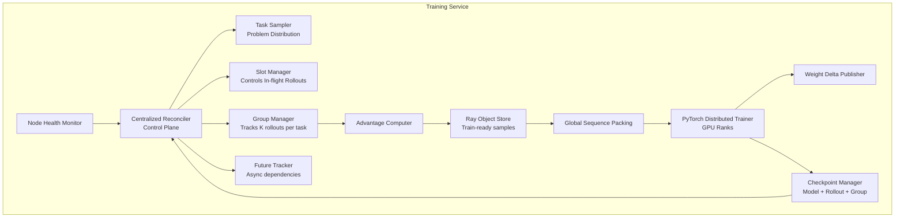

```mermaid
flowchart TB
    subgraph TRAINING_SERVICE["Training Service"]
        RECON["Centralized Reconciler<br/>Control Plane"]
        TASK_SAMPLER["Task Sampler<br/>Problem Distribution"]
        SLOT_MGR["Slot Manager<br/>Controls In-flight Rollouts"]
        GROUP_MGR["Group Manager<br/>Tracks K rollouts per task"]
        FUTURES["Future Tracker<br/>Async dependencies"]
        ADV["Advantage Computer"]
        PACKER["Global Sequence Packing"]
        RAY["Ray Object Store<br/>Train-ready samples"]
        TRAINER["PyTorch Distributed Trainer<br/>GPU Ranks"]
        HEALTH["Node Health Monitor"]
        CKPT["Checkpoint Manager<br/>Model + Rollout + Group"]
        WEIGHT_PUB["Weight Delta Publisher"]
    end

    RECON --> TASK_SAMPLER
    RECON --> SLOT_MGR
    RECON --> GROUP_MGR
    RECON --> FUTURES
    GROUP_MGR --> ADV
    ADV --> RAY
    RAY --> PACKER
    PACKER --> TRAINER
    TRAINER --> WEIGHT_PUB
    TRAINER --> CKPT
    HEALTH --> RECON
    CKPT --> RECON


```